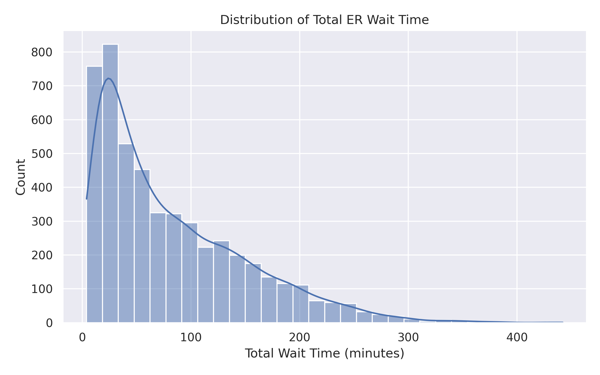
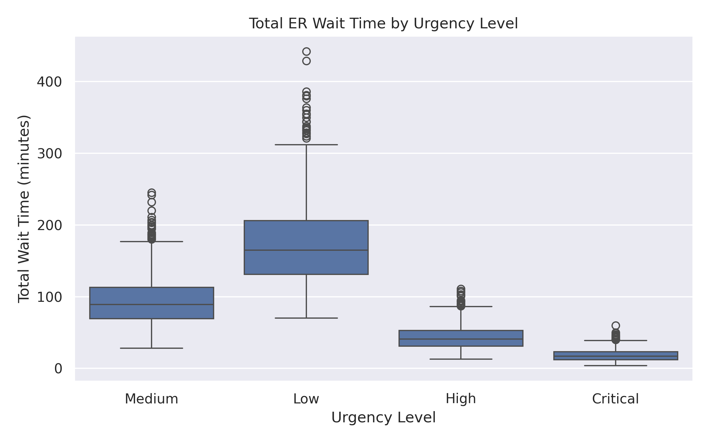
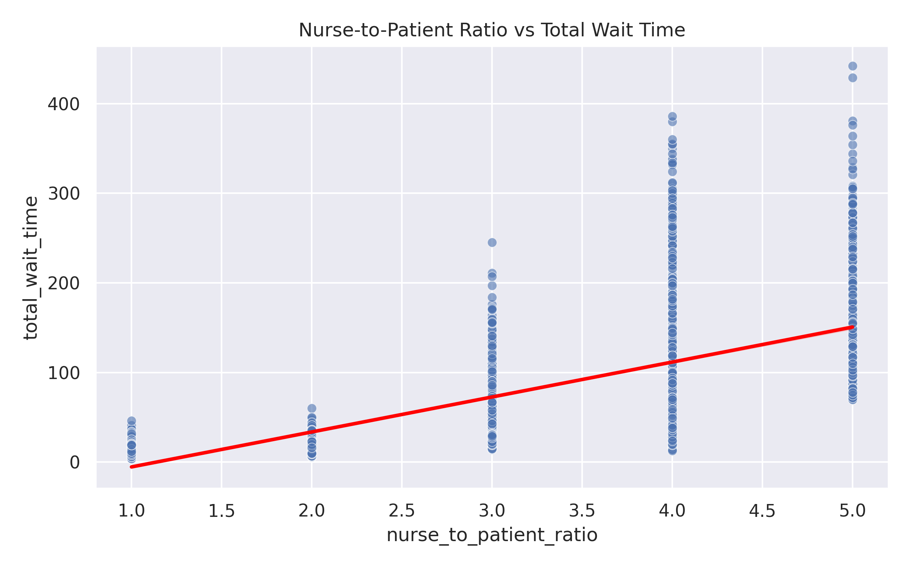
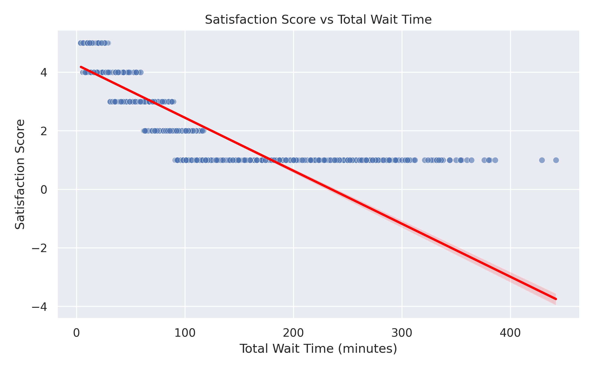

🏥 ER Wait Times Analysis

Exploratory data analysis (EDA) of emergency department wait times, staffing levels, and patient satisfaction metrics. This project investigates operational drivers of ER delays and identifies key factors influencing patient experience

📊 Project Objectives

This analysis aims to:

- Understand the distribution of ER wait times

- Evaluate how urgency level affects time to care

- Analyze the impact of nurse staffing ratios on delays

- Examine the relationship between wait time and patient satisfaction

- Identify operational bottlenecks that affect patient outcomes

## 📁 Repository Structure

```text
er-wait-times-eda/
│
├── data/
│   ├── raw/                    # Original dataset
│   └── processed/              # Cleaned data (future use)
│
├── notebooks/
│   └── 01_er_wait_times_eda.ipynb
│
├── visuals/                    # Generated visualizations
│   ├── total_wait_time_distribution.png
│   ├── wait_time_by_urgency.png
│   ├── nurse_ratio_vs_wait_time.png
│   └── satisfaction_vs_wait_time.png
│
└── README.md

```

🧾 Dataset Overview

The dataset contains 5,000 ER visit records across multiple hospitals, including:

- Patient and visit identifiers
- Urgency level (Low, Medium, High, Critical)
- Nurse-to-patient ratio
- Specialist availability
- Facility size
- Time to registration, triage, and medical professional
- Total wait time
- Patient satisfaction score
- Visit date, region, and hospital name

No missing values were present in the dataset.

### 📈 Key Insights

1️⃣ Distribution of Total ER Wait Time




Findings:

- Most patients wait between 30–80 minutes.
- The distribution is right-skewed, indicating occasional extreme delays.
- Some cases exceed 300 minutes, suggesting operational bottlenecks or staffing constraints.


2️⃣ Wait Time by Urgency Level



| Urgency Level | Average Wait Time (minutes) |
| ------------- | --------------------------- |
| Critical      | 18.4                        |
| High          | 43.2                        |
| Medium        | 93.7                        |
| Low           | 173.5                       |

Insights:

- Higher urgency patients are treated significantly faster.
- Low urgency cases experience substantially longer delays.
- The triage system appears operationally effective.

3️⃣ Nurse-to-Patient Ratio vs Wait Time


  
Findings:

- A higher nurse-to-patient ratio (more patients per nurse) is associated with longer wait times.
- The positive trend indicates staffing constraints directly impact operational delays.
- Facilities with ratios ≥ 4 show significant wait time increases.

4️⃣ Patient Satisfaction vs Wait Time



Findings:

- Strong negative correlation between wait time and satisfaction score.
- Satisfaction drops sharply after ~120 minutes.
- Extended delays directly reduce patient experience metrics.

📌 Business Implications

- Staffing optimization can reduce ER delays.
- Prioritization systems effectively accelerate critical care.
- Reducing wait times may significantly improve patient satisfaction scores.
- Operational analytics can help hospitals forecast bottlenecks.

🛠 Tools Used

- Python
- Pandas
- NumPy
- Seaborn
- Matplotlib
- Google Colab
- GitHub

▶️ How to Run This Project

Clone the repository:

```text
git clone https://github.com/MChanda17/er-wait-times-eda.git
```

Open the notebook:

```text
notebooks/01_er_wait_times_eda.ipynb
```

Install dependencies:

```text
pip install pandas numpy matplotlib seaborn
```
Run all cells in Jupyter Notebook or Google Colab.

⭐ Final Thoughts

This project demonstrates how operational and patient-level data can reveal meaningful insights about ER efficiency, staffing challenges, and patient experience. By combining descriptive statistics, visual exploration, and business interpretation, this analysis highlights how data can support more informed decision-making in healthcare settings.
